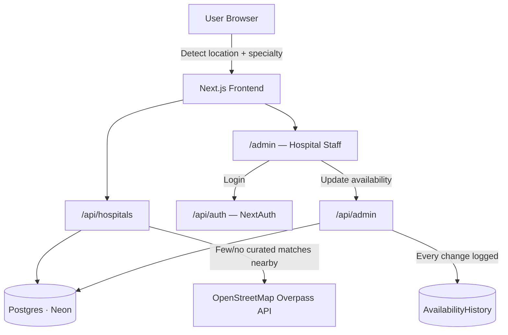

# 🏥 Hospital Finder — Emergency Hospital Finder Platform


A platform that helps people find the nearest hospital with the right medical specialty and up-to-date bed availability — including when they're traveling somewhere with no prior data about local hospitals.

## The Problem

During a medical emergency, people often don't know which nearby hospital actually has the department they need (ICU, trauma, pediatric, cardiac, etc.) or has the capacity to take them. This is worse for travelers, who may be in an unfamiliar city with no idea which hospitals exist nearby at all.

## The Solution

Hospital Finder lets a user detect their location, optionally filter by required specialty, and see nearby hospitals ranked by a combination of **distance and real-time reported availability** — not distance alone. If the user is somewhere outside the app's curated hospital network, it automatically falls back to live OpenStreetMap data so they're never left with zero results.

## Key Features

- **Location-based search** — auto-detect or manual location entry
- **Specialty filtering** — Trauma, Cardiac, ICU, Burns, Pediatric, Dialysis, Maternity
- **Availability-aware ranking** — a hospital reporting "Full" is deprioritized even if it's closer, rather than ranked purely by distance
- **Works anywhere** — curated hospital data is supplemented by a live OpenStreetMap (Overpass API) lookup for locations outside the curated network, with an expanding search radius for remote areas
- **One-tap actions** — call the hospital directly, or get Google Maps directions
- **Hospital admin panel** — authenticated hospital staff can update their own hospital's availability per specialty, with every change recorded in an audit trail
- **Per-hospital authorization** — an admin can only ever modify the hospital they're linked to, enforced server-side, not just hidden in the UI

## Tech Stack

| Layer | Technology |
|---|---|
| Framework | Next.js 14 (App Router) |
| Language | TypeScript |
| Database | PostgreSQL (Neon, serverless) |
| ORM | Prisma |
| Authentication | NextAuth.js (Credentials provider, JWT sessions) |
| Mapping | Leaflet + OpenStreetMap |
| External data | OpenStreetMap Overpass API |
| Testing | Jest |
| CI | GitHub Actions |
| Hosting | Vercel |

## Architecture



Data model: a `Hospital` has many `Specialty` entries through a `HospitalSpecialty` join table, so **availability is tracked per department, not per hospital** — a hospital can be "Available" for ICU while "Full" for Maternity at the same time. Every status change is written to an `AvailabilityHistory` table with the acting admin's identity attached, rather than overwriting silently.

## Getting Started

```bash
git clone https://github.com/Bhupesh150603/Hospital_Finder.git
cd Hospital_Finder
npm install
```

Create a `.env` file in the project root:

| Variable | Description |
|---|---|
| `DATABASE_URL` | Pooled Postgres connection string (Neon) |
| `DATABASE_URL_UNPOOLED` | Direct connection string, used by Prisma migrations |
| `NEXTAUTH_SECRET` | Random secret for session signing — generate with `node -e "console.log(require('crypto').randomBytes(32).toString('base64'))"` |
| `NEXTAUTH_URL` | `http://localhost:3000` for local development |

Set up the database:
```bash
npx prisma migrate dev
npx tsx prisma/seed.ts
```

Create an admin account for testing (links an email/password to a specific hospital by name):
```bash
node scripts/create-admin.js you@example.com yourpassword "AIIMS"
```

Run the app:
```bash
npm run dev
```

## Running Tests

```bash
npm test
```

Current coverage includes the distance/ranking logic in `lib/haversine.ts` — including a regression test for a real bug caught during development, where a specialty filter was silently returning unrelated hospitals (see [Key Engineering Decisions](#key-engineering-decisions--trade-offs) below).

## Deployment

Deployed on Vercel, connected to this repository. Production and Preview environments each require their own copies of the four environment variables above (`NEXTAUTH_URL` must match the actual deployed domain for each environment). Database migrations are currently run manually against Neon rather than as part of the deploy pipeline.

## Key Engineering Decisions & Trade-offs

**Availability-aware ranking, not just distance.** The core ranking function combines distance with a penalty for reported unavailability, so a full hospital 2km away ranks behind an available one 6km away. This was a deliberate design choice made after noticing that pure-distance ranking doesn't actually solve the stated problem.

**A real bug, and what it taught.** Early on, selecting a specific specialty (e.g. "Cardiac") returned unrelated hospitals, including ones with no matching department at all. The root cause was that filtering logic wasn't strictly checking specialty membership before ranking. This is now covered by an automated regression test, so the same class of bug can't silently reappear.

**Per-specialty, not per-hospital, availability.** The data model was deliberately normalized (`Hospital` → `HospitalSpecialty` → `Specialty`) rather than storing one flat status per hospital, since a hospital being "at capacity" for Maternity says nothing about its ICU beds.

**Authorization enforced server-side, not just in the UI.** Early in development, the admin page was gated behind login, but the underlying API route had no session check of its own — meaning a direct API call could bypass the UI entirely. This was fixed by checking the session and hospital ownership inside the API route itself, on every request.

**Explicit version pinning.** Several dependencies (Prisma, TypeScript) shipped major version changes with breaking CLI/behavior changes during development. Rather than install "latest" for every package, dependencies are pinned to specific tested versions, and CI uses `npm ci` (not `npm install`) to guarantee every environment installs the exact same versions.

## Known Limitations / Future Work

This project is built to demonstrate the core product idea and solid engineering practices — it is **not** currently suitable for handling real emergencies, for reasons that are mostly non-technical:

- **Availability is self-reported**, not verified against real hospital systems. There's no mechanism yet to confirm the person updating a hospital's status actually works there beyond the initial account creation.
- **No staleness expiry** — a status reported hours ago is displayed the same as one reported a minute ago.
- **OSM/community-sourced results** have no specialty or capacity data — they're a fallback for "at least tell the user a hospital exists nearby," not a verified match.
- **The in-memory OSM cache is per-instance** — at real scale across multiple serverless instances, this wouldn't provide consistent caching.
- Accessibility (screen readers, full keyboard navigation, contrast auditing) and offline/PWA support have not yet been implemented.
- No rate limiting on public API routes yet.

## Project Structure

```
app/
  api/hospitals/    — search + ranking endpoint
  api/admin/        — hospital admin CRUD, session-protected
  api/auth/         — NextAuth route handler
  admin/            — admin dashboard + login (protected by middleware)
lib/
  haversine.ts      — distance calculation + ranking logic (tested)
  overpass.ts       — OpenStreetMap fallback lookup
  auth.ts           — NextAuth configuration
  prisma.ts         — Prisma client singleton
prisma/
  schema.prisma     — data model
  seed.ts           — seeds curated hospital data
scripts/
  create-admin.js   — CLI helper to create a hospital admin account
```